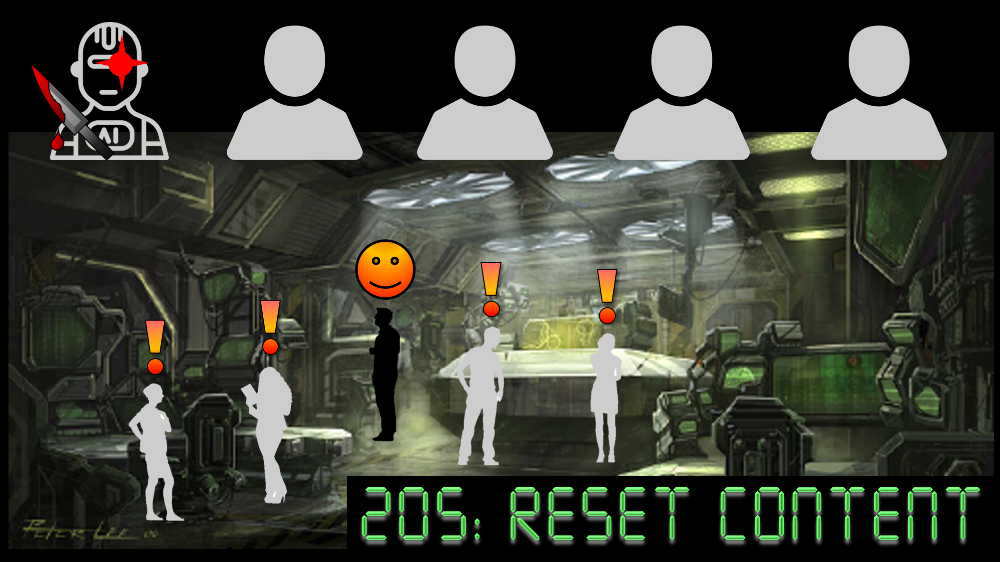

# AI205 : RESET CONTENT

2123년, 극한까지 발전해버린 AI는 인간의 존속을 위협하고 있다. 
인간인 척하며 시민들을 살해하고 다니는 미믹봇을 초기화 하라!

---
## 기획 배경
기존 실시간 2D 역할 추론 게임들은 문자와 음성을 통해 플레이어 간 상호작용을 제공한다. 전략 보드게임에서는 얼굴 표정을 통해 유추할 수 있는 정보가 많은데, 이를 게임에 녹여내어 좀 더 실감나고 재미있는 게임을 개발하고자 했다.

---
## 주요기능
(Gif 하나씩 넣으면 좋을듯)

### 실시간 멀티 게임
- 같은 방에 입장한 플레이어들은 같이 게임을 즐길 수 있음
- 다른 플레이어들과 화상 및 음성으로 대화할 수 있음
- 닉네임과 캐릭터 색깔을 통해 서로를 구분

### 캐릭터 동작
- 플레이어는 게임 맵을 키보드로 이동하며 마우스를 이용해 오브젝트 및 다른 플레이어와 상호작용 가능
- 시민 플레이어는 미션을 해결하고 시체를 신고할 수 있음
- 마피아 플레이어는 시민을 살해하거나 사보타지를 발생해 시민의 미션 해결을 방해할 수 있음
- 살해된 시민은 유령이 되어 자유롭게 이동하며 미션을 해결할 수 있음

### 마피아 선정 회의
- 게임 중 회의를 소집 가능
- 회의는 화상, 음성, 텍스트 채팅으로 진행
- 회의는 플레이어의 시작 시그널과 함께 시작하며, 서버의 종료 시그널로 종료됨
- 중간 투표를 통해 일정 이상 득표한 플레이어 탈락

### 동작 인식 미션
- WebRTC와 Teachable machine 활용한 팀/ 개인 미션
- 맵의 특정 위치에 미션을 발동할 수 있는 오브젝트가 존재함
- 게임 시작 시 시민 플레이어들에게 랜덤 미션 부여
- 마피아의 사보타지 발생 시 시민 플레이어들은 협동 미션을 통해 사보타지 해제 가능
- 시민은 개인 별 동작 인식 미션을 모두 해결해 게임에서 승리할 수 있음 

---
## 차별점
- 플레이어간의 상호작용 기능으로 화상 채팅을 제공 -> 플레이어는 서로의 표정을 통해 더 많은 정보를 얻어 전략적으로 활용 가능
- 모션 인식을 이용한 미션 -> 사용자의 동작을 인식하는 미션으로 재미있는 플레이 가능
- 협동 미션 -> 팀원 간 협동 미션을 통해 비대면 상황에서도 연결감을 느낄 수 있음

---
## 사용기술

### 게임 클라이언트
- React
- Three.js
- Teachable machine

### 게임 서버
- Spring boot
- Websocket & Stomp

### 화상채팅
- Open Vidu

### 배포
- 도커
- Nginx

---
## 발표자료

